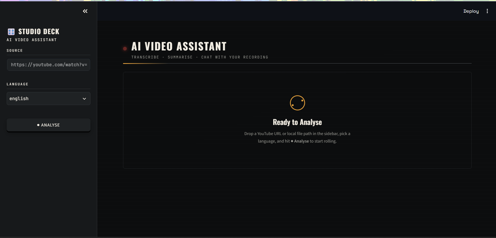
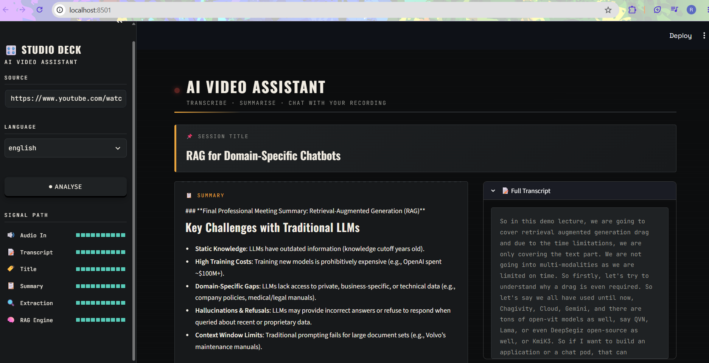
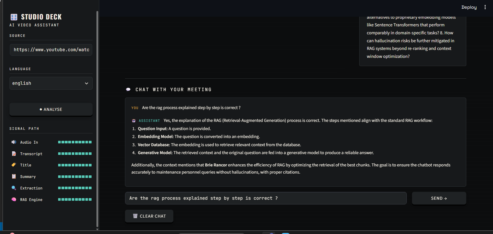

# 🎥 AI Video Assistant

<p align="center">
An AI-powered Meeting Intelligence Assistant that transcribes YouTube videos and uploaded audio/video files, generates AI-powered meeting summaries, extracts action items & key decisions, and lets you chat with your meetings using Retrieval-Augmented Generation (RAG).
</p>

<p align="center">


</p>

---

## 🚀 Overview

AI Video Assistant transforms meeting recordings into structured insights.

Simply provide a **YouTube URL** or upload an **audio/video file**, and the assistant automatically:

- 🎙️ Transcribes meetings
- 📝 Generates concise AI summaries
- ✅ Extracts action items
- 👥 Identifies owners
- 📅 Detects deadlines
- 💡 Captures key decisions
- ❓ Lists open questions
- 💬 Enables conversational Q&A using RAG
- 📄 Exports reports as PDF or TXT

---

# ✨ Features

- 🎥 Supports YouTube videos
- 📁 Upload local audio/video files
- 📝 English transcription using OpenAI Whisper (Local)
- 🌏 Hindi & Hinglish transcription using Sarvam AI
- 📋 AI-generated meeting summaries
- ✅ Action Item Extraction
- 👤 Owner Detection
- 📅 Deadline Identification
- 💡 Key Decision Extraction
- ❓ Open Questions & Follow-ups
- 💬 Chat with meeting using RAG
- 🔍 Semantic Search with ChromaDB
- 📄 Export reports as PDF/TXT
- ⚡ Interactive Streamlit Interface

---

# 🖼️ Screenshots

## 🏠 Home Page

Upload a YouTube URL or audio/video file to start analyzing your meeting.



---

## 📝 AI Meeting Summary

Automatically generated meeting summary with action items, key decisions, and follow-ups.



---

## 💬 Chat with Your Meeting

Ask natural language questions and retrieve answers using Retrieval-Augmented Generation (RAG).



---

# 🏗️ System Architecture

```text
                Video / Audio / YouTube URL
                          │
                          ▼
                  Audio Extraction
                          │
        ┌─────────────────┴─────────────────┐
        │                                   │
        ▼                                   ▼
 Whisper (English)                  Sarvam AI
                                    (Hindi/Hinglish)
        │                                   │
        └──────────────┬────────────────────┘
                       ▼
                 Transcript Generated
                       │
         ┌─────────────┴─────────────┐
         ▼                           ▼
   Mistral AI                   ChromaDB
 Summary & Insights             Vector Store
         │                           │
         └─────────────┬─────────────┘
                       ▼
                 LangChain LCEL
                       │
                       ▼
                Streamlit Interface
```

---

# 🛠️ Tech Stack

| Category | Technology |
|-----------|------------|
| Programming Language | Python |
| UI Framework | Streamlit |
| LLM | Mistral AI |
| English Speech-to-Text | OpenAI Whisper |
| Hindi/Hinglish STT | Sarvam AI |
| Framework | LangChain LCEL |
| Vector Database | ChromaDB |
| Embeddings | HuggingFace |
| PDF Export | ReportLab |

---

# 📂 Project Structure

```text
AI-Video-Assistant
│
├── core/
│
├── utils/
│
├── assets/
│
├── app.py
├── main.py
├── requirements.txt
├── README.md
└── .gitignore
```

---

# ⚙️ Installation

Clone the repository

```bash
git clone https://github.com/rohanbaviskarr/AI-Video-Assistant.git
```

Move into the project

```bash
cd AI-Video-Assistant
```

Create a virtual environment

```bash
python -m venv .venv
```

Activate it

### Windows

```bash
.venv\Scripts\activate
```

### macOS / Linux

```bash
source .venv/bin/activate
```

Install dependencies

```bash
pip install -r requirements.txt
```

---

# 🔑 Environment Variables

Create a `.env` file.

```env
MISTRAL_API_KEY=your_api_key

SARVAM_API_KEY=your_api_key
```

---

# ▶️ Run the Application

```bash
streamlit run app.py
```

---

# 💬 Example Questions

Once transcription is complete, you can ask:

- What decisions were made?
- What are the pending action items?
- Who is responsible for each task?
- What deadlines were discussed?
- Summarize the meeting in five bullet points.

---

# 📄 Export Reports

The generated meeting report can be exported as:

- 📄 PDF
- 📝 TXT

---

# 🚀 Future Improvements

- Speaker Diarization
- Live Meeting Support
- Zoom Integration
- Microsoft Teams Integration
- Google Meet Integration
- Multi-language Translation
- Email Summary Generation
- Meeting Analytics Dashboard

---

# 🤝 Contributing

Contributions are welcome!

If you'd like to improve this project:

1. Fork the repository
2. Create a feature branch
3. Commit your changes
4. Open a Pull Request

---

# 👨‍💻 Author

**Rohan Baviskar**

GitHub: https://github.com/rohanbaviskarr

---

⭐ If you found this project useful, consider giving it a star!